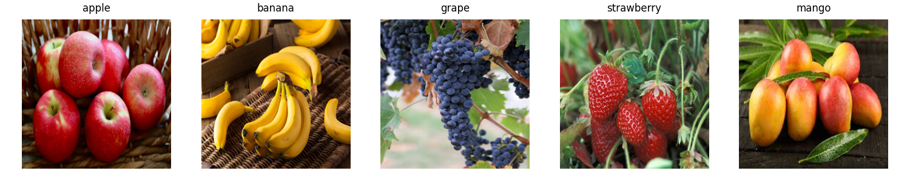
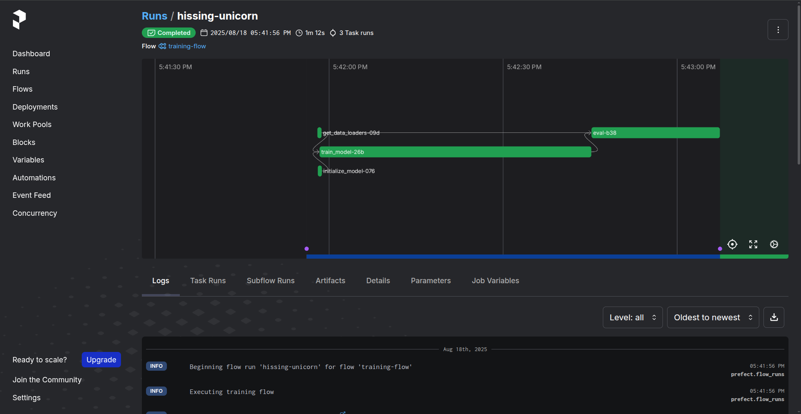
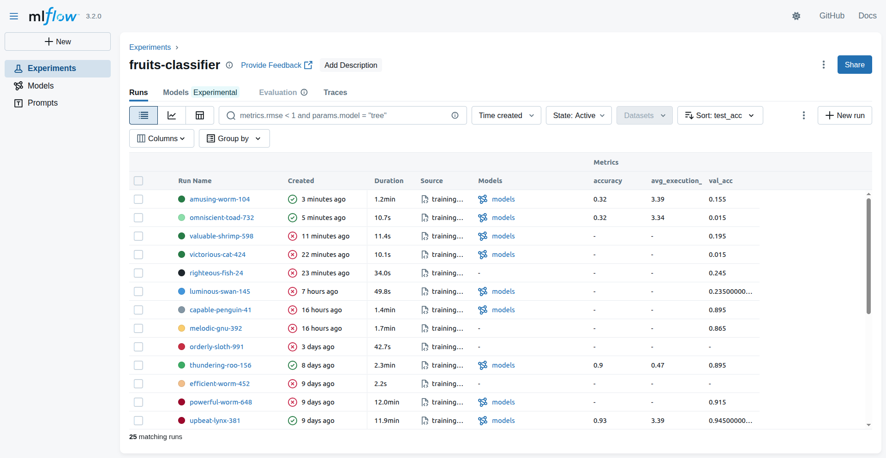
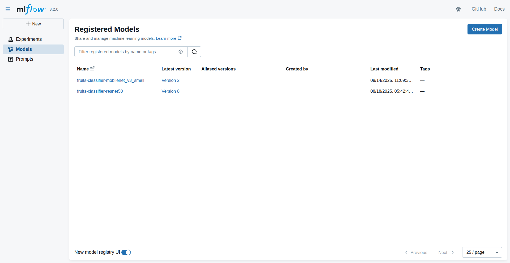

# MLOps Zoomcamp Final Project 2025

This repository contains the final project for the [MLOps Zoomcamp](https://github.com/DataTalksClub/mlops-zoomcamp)

[](https://github.com/facug91/mlops-zoomcamp-final-project/actions/workflows/python-tests.yml)


## Project: Fruits Classification



### Problem description

Accurate classification of fruits from images is an important task in applications such as automated retail systems, agriculture monitoring, and inventory management.  
In real-world scenarios, fruit sorting and identification are often done manually, which can lead to human errors, inefficiencies, and increased labor costs.  
Automating this process can improve speed, accuracy, and scalability in environments such as:  
- Smart supermarkets — automatic detection of fruits at checkout.
- Food supply chains — quality control and classification in packaging facilities.
- Robotics — enabling fruit-handling robots to recognize and sort products.

This project implements a deep learning-based fruit classifier that takes an image as input and outputs the predicted fruit category along with the confidence scores for all classes.  
The model is deployed as a REST API, enabling integration with other services and workflows.  

### Dataset description

The dataset used in this project is the public [Fruits Classification Dataset](https://www.kaggle.com/datasets/utkarshsaxenadn/fruits-classification/data) from Kaggle, containing images of 5 fruit categories:  
- Apple
- Banana
- Grape
- Mango
- Strawberry

Each image is RGB and belongs to one of the five classes, stored in separate directories for training, validation, and test sets.
The dataset is already preprocessed and balanced, making it suitable for supervised classification tasks without additional labeling.

### Repository scope and objective

This repository contains the complete workflow for training, deploying, and serving a fruit image classification model, including:
- Model training and evaluation using PyTorch and a fine-tuned ResNet-50 architecture.
- Model serving through a Flask-based API with a /predict endpoint that accepts uploaded images.
- MLOps integrations:
  - Logging predictions and execution metrics into a PostgreSQL database.
  - Storing uploaded images in MinIO (S3-compatible) and linking them with database records.
  - Experiment tracking using MLflow.
- Infrastructure and automation:
  - Docker-based containerization for reproducible environments.
  - GitHub Actions for CI pipeline execution and testing.
  - Modular architecture separating model logic, metrics storage, and API service.


## Building Docker Images

This project provides two Docker environments:

- **CPU version** located in `docker/cpu`
- **GPU version** located in `docker/gpu`

Build Arguments

- `ENV=prod`: production environment (default packages only)
- `ENV=dev`: development environment (includes dev dependencies)

Both versions include:

- `requirements.txt` always installed
- `requirements-dev.txt` installed **only** when `ENV=dev`

**Note:**
If you only want to run the service and use the pre-built images, you can pull them directly from my GitHub Container Registry without building locally:
- ghcr.io/facug91/ml-dev-env-cpu:latest
- ghcr.io/facug91/ml-prod-env-cpu:latest
- ghcr.io/facug91/ml-dev-env-gpu:latest
- ghcr.io/facug91/ml-prod-env-gpu:latest

### Included Tools and Libraries

Both CPU and GPU environments come pre-installed with:

- **Experiment Tracking & Model Registry**
  - [MLflow](https://mlflow.org/)

- **Machine Learning framework**
  - [PyTorch](https://pytorch.org/) and [TorchVision](https://pytorch.org/vision/stable/index.html)

- **Cloud and Storage**
  - [boto3](https://boto3.amazonaws.com/v1/documentation/api/latest/index.html)
  - [botocore](https://botocore.amazonaws.com/)

- **Databases**
  - [psycopg2-binary](https://pypi.org/project/psycopg2-binary/)

Development images (`ENV=dev`) also include extra dependencies for debugging and development.

- **Workflow Orchestration**
  - [Prefect](https://www.prefect.io/)

- **Unit and integration testing**
  - [pytest](https://docs.pytest.org/)

- **Machine Learning tools**
  - [scikit-learn](https://scikit-learn.org/stable/)
  - [tqdm](https://tqdm.github.io/)

### **Building the CPU image**

```bash
docker build \
  -f docker/cpu/Dockerfile \
  --build-arg ENV=dev \
  -t ml-dev-env-cpu \
  ./docker/cpu
```

### **Building the GPU image**

Requirements:

- [NVIDIA driver 570 or above (compatible with CUDA 12.8)](https://docs.nvidia.com/datacenter/tesla/driver-installation-guide/index.html)

- [NVIDIA Container Toolkit](https://docs.nvidia.com/datacenter/cloud-native/container-toolkit/latest/install-guide.html)

```bash
docker build \
  -f docker/gpu/Dockerfile \
  --build-arg ENV=dev \
  -t ml-dev-env-gpu \
  ./docker/gpu
```


## Running the Development or Production Environment

This project uses [Docker Compose](https://docs.docker.com/compose/) to manage all services, with support for **profiles** to choose which environment to start.

### Profiles Available

The `docker-compose.yml` defines multiple profiles so you can choose what environment to run:

- `prod-cpu`: Production environment (CPU version)
- `prod-gpu`: Production environment (GPU version, requires NVIDIA GPU)
- `dev-cpu`: Development environment (CPU version)
- `dev-gpu`: Development environment (GPU version, requires NVIDIA GPU)

### Starting the environment

**Example: Development with GPU**

```bash
docker compose --profile dev-gpu up --build
```

_Replace the profile name according to your needs._

### Working inside the container

When running a dev-* profile, you can attach VS Code to the development container using the Dev Containers extension:
1. In VS Code, open the command palette (Ctrl+Shift+P).
2. Select `Dev Containers: Attach to Running Container...`
3. Choose the container:
  - For GPU dev: ml-dev-env-gpu
  - For CPU dev: ml-dev-env-cpu

Once attached, you can run scripts inside the container, from the /workspace directory.


## Preparing the Dataset

The dataset is downloaded and prepared using the script `prepare_dataset.py`.  
This step only needs to be done **once**, since it always downloads the same dataset.

### Steps

1. Attach to the development container (e.g., `ml-dev-env-cpu` or `ml-dev-env-gpu`) using VS Code Dev Containers or `docker exec`.

2. In workspace folder run the dataset preparation script:
  ```bash
  python prepare_dataset.py
  ```

### What the script does

- Downloads the dataset archive from Kaggle.
- Extracts the files into a temporary folder.
- Creates the final dataset structure under `workspace/data/fruits-dataset`.
- Renames the validation folder from `valid` to `val`.

After running this step, you will have a ready-to-use dataset in `workspace/data/fruits-dataset`.


## Training the Classification Model

The training script allows you to train a fruit classification model using either **MobileNetV3-Small** or **ResNet50**.

### Steps

1. Attach to the development container (`ml-dev-env-cpu` or `ml-dev-env-gpu`).

2. In workspace folder run the training script with the model of your choice:

  **Train MobileNetV3-Small (recommended for CPU):**
  ```bash
  python training.py --model-name mobilenet_v3_small
  ```
  **Train ResNet50 (larger, better suited for GPU):**
  ```bash
  python training.py --model-name resnet50
  ```

### Monitoring training

In the training process, `prefect` is used as workflow orchestrator, which can be used to monitore the training process:



Also MLflow is used for experiment tracking:



And trained models are register in the MLflow model registry:



### Output

The trained models are stored in the `workspace/models` directory.

Two pre-trained models (mobilenet_v3_small and resnet50) are already included under workspace/web-service/models in this repository. This allows you to skip training and test the web service directly.


## Moving the Classification Model to Production with MLflow model registry

The models are store in the model registry when you train them, without any stage. To move a model to stage `Production`, you can use the script model_to_production, specifying the name of the model. The model with the highest accuracy will be the one moved.

### Steps

1. Attach to the development container (`ml-dev-env-cpu` or `ml-dev-env-gpu`).

2. In workspace folder run the script to move the best model:

  **Move MobileNetV3-Small:**
  ```bash
  python prepare_dataset.py --model-name mobilenet_v3_small
  ```
  **Move ResNet50:**
  ```bash
  python prepare_dataset.py --model-name resnet50
  ```

Then you can use the model like this `mlflow.pytorch.load_model("models:/fruits-classifier-mobilenet_v3_small/Production")`.


## Running Unit Tests

Unit tests validate the core logic of the web service in isolation, without requiring external services such as PostgreSQL or MinIO (these dependencies are mocked).

### Steps

1. Attach to the development container (`ml-dev-env-cpu` or `ml-dev-env-gpu`).

2. Navigate to the unit test folder:
  ```bash
  cd workspace/web-service/tests
  ```

3. Run the tests with pytest:
  ```bash
  pytest -v model_test.py prediction_logger_test.py
  ```

**Notes**

- These tests run entirely inside the development container.
- They do not require any database or S3 storage to be available.
- Use them to quickly validate changes in the web-service codebase.
- They are automatically run with github actions.


## Running Integration Tests

Integration tests validate the complete flow of the web service, including the Flask API, PostgreSQL database, and S3 storage (MinIO).  

### Steps

1. Attach to the development container (`ml-dev-env-cpu` or `ml-dev-env-gpu`).

2. In one terminal inside the development container, start the Flask web service:
  ```bash
  flask run --host 0.0.0.0 --port 8080 --debug
  ```
  The --debug flag is recommended during development because it enables auto-reload.

3. Open a second terminal inside the same development container and run the integration tests:
  ```bash
  cd /workspace/web-service/integration_tests
  pytest -v test_predict_live.py
  ```

**Notes**
- These tests send real HTTP requests to the running Flask service at http://localhost:8080.
- They verify:
  - That predictions return a valid label and probability.
  - That invalid requests (e.g., missing or corrupted images) are handled correctly.
